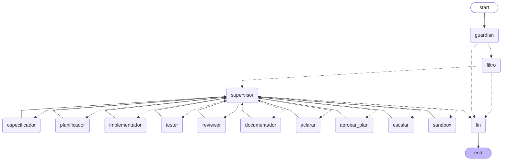

# Grafo de la fábrica (generado)

Generado con `uv run python -m fabrica grafo --salida docs/grafo.md` (`app.get_graph().draw_mermaid()`). No se edita a mano.

```mermaid
---
config:
  flowchart:
    curve: linear
---
graph TD;
	__start__([<p>__start__</p>]):::first
	guardian(guardian)
	filtro(filtro)
	supervisor(supervisor)
	especificador(especificador)
	planificador(planificador)
	implementador(implementador)
	tester(tester)
	reviewer(reviewer)
	documentador(documentador)
	aclarar(aclarar)
	aprobar_plan(aprobar_plan)
	escalar(escalar)
	sandbox(sandbox)
	fin(fin)
	__end__([<p>__end__</p>]):::last
	__start__ --> guardian;
	aclarar --> supervisor;
	aprobar_plan --> supervisor;
	documentador --> supervisor;
	escalar --> supervisor;
	especificador --> supervisor;
	filtro -.-> fin;
	filtro -.-> supervisor;
	guardian -.-> filtro;
	guardian -.-> fin;
	implementador --> supervisor;
	planificador --> supervisor;
	reviewer --> supervisor;
	sandbox --> supervisor;
	supervisor -.-> aclarar;
	supervisor -.-> aprobar_plan;
	supervisor -.-> documentador;
	supervisor -.-> escalar;
	supervisor -.-> especificador;
	supervisor -.-> fin;
	supervisor -.-> implementador;
	supervisor -.-> planificador;
	supervisor -.-> reviewer;
	supervisor -.-> sandbox;
	supervisor -.-> tester;
	tester --> supervisor;
	fin --> __end__;
	classDef default fill:#f2f0ff,line-height:1.2
	classDef first fill-opacity:0
	classDef last fill:#bfb6fc
```
